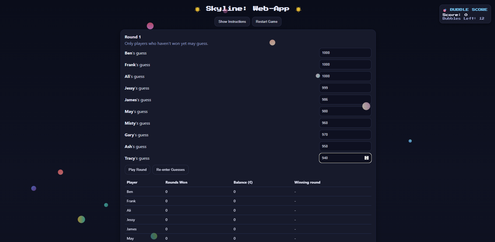

# Instructions and screenshots of an example gameplay

Home page
 this is where ou start the game ofcourse you will first need to gather players. Chose wisely!
 Play this game with 2 up to 100 players.
Also agree upon a maximum amount per bet per round. The frequency of the rounds played may very as often as you like daily, weekly, monthly. I would recommand you to play monthly so you can put a budget aside from your other income..

## Now here is an example of the gameflow to give you an idea of how it all will work out for everybody.

This is the homepage - landing page where you can find the instructions an a restart button. Just put in the number of players and their names and start the bets.

## The instructions are very simple just make sure every player has read and understood the rules of the game. Consistancy is key here!

# Example gameplay

In this example we will play the game with ten players for a total of ten rounds with max amount of 1000. Games can be played with any max amount from 100 to 1000 100 000 or even a 1000000!

Place your bets! Here we put in our bets ourselves but in reality each player places their own desired bet.

# Remember evey payer who as not won a round yet places a bet each round and the one with the lowest bet winns the pot. 

The pot is the lowest amount times the total number of players. Remember each player can only win once. So everybody gets to win!

In case there's a draw where two players guess the same lowest amount they will continue betting untill there is only one to decide the winner of that round.

# After the final round 

After each player won a round the game is finished and a summary graph and statistics of each players win will be provided.

# Interaftive graph

# Summary statistics per winning round

# Congratulations you all have reached the finish line

# Restart and play as many time as you like.

# Tips and tricks

Make sure to play with people from all (financial) backgrounds.. youngsters, students seniors. We are all part of the economy.

In this competition based individualistic capitalistic on-demand hyper interactive instant satisfaction economy - we all need to be healthy physically mentally spiritually and degitally / financially 

Thanks to this skyline-project
 we are free to express in any way like. Become whomever we always want to be and give the best version of ourselves!
 
 To often there were berriers where talented students couldn't afford to live their student lifes compftably. Now even underprivilledged immigrants families have a way to allocate recources in the most efficient way. 

This game also supports the communist people who like to live their lives at their own pace since this provides an alternative to the sometimes to compatative nature of capitalistic dreams. Just live your live you always wanted to live.

Even worst case scenerios are less worsten because we want to live long and enjoy our pension together with all our grandchildren withour favorism. Just teach them how to play this game young. 

In the unlikely even if one player is not able to afford to play. There are plenty of other players that can cover up for the loss instead of just one person. I hope to relief pressure of that one person in this way also. We humans are social creatures so if we really want we can work on being a reputable trustworthy personality. Better later than never.. right?! 

Goodluck !
Anny feedback is webcome!

